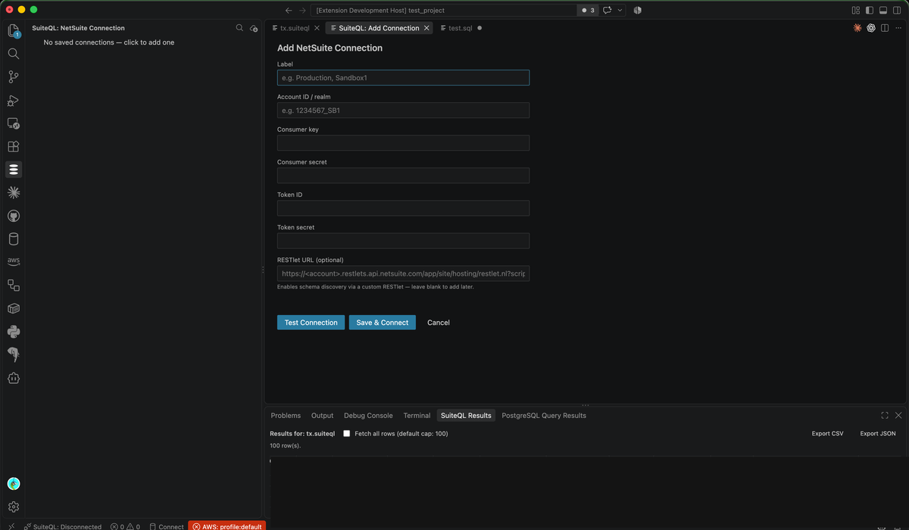
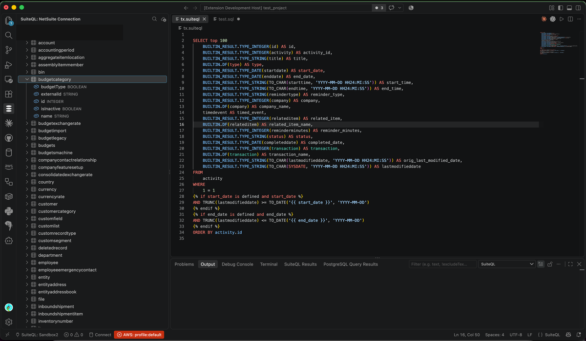
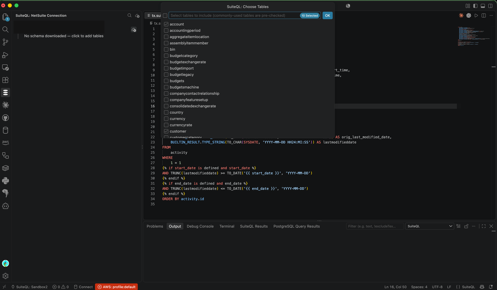
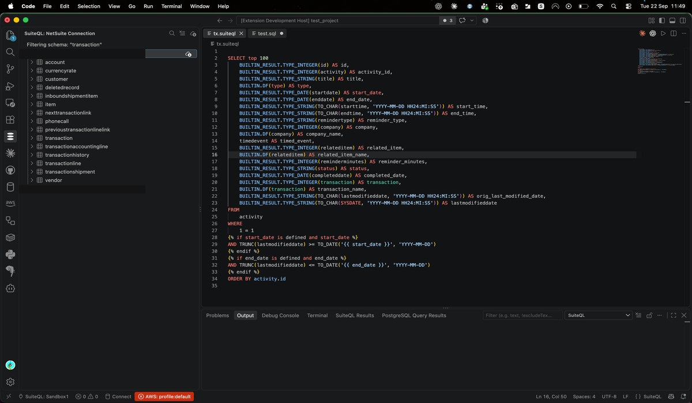
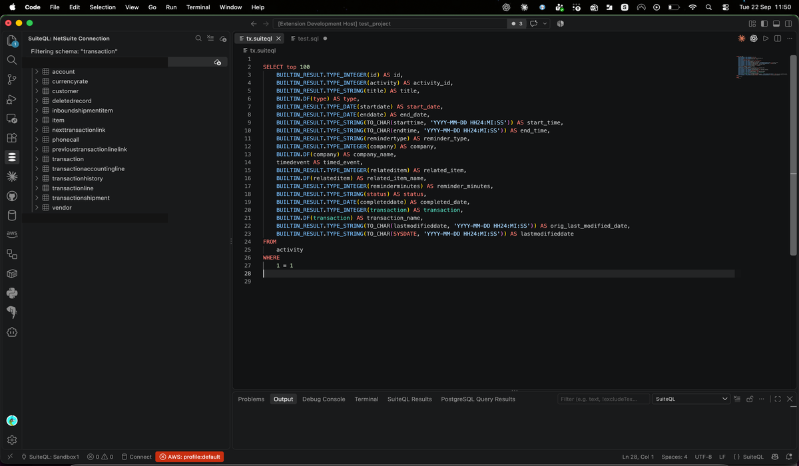
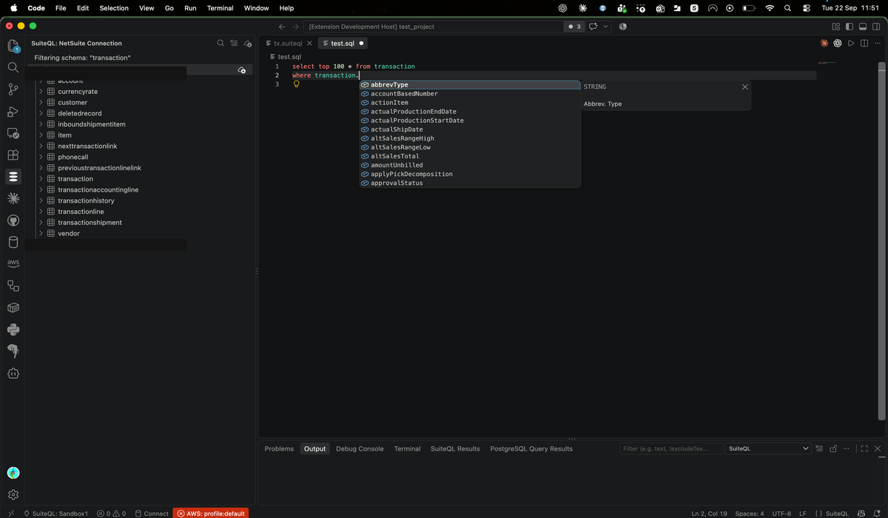
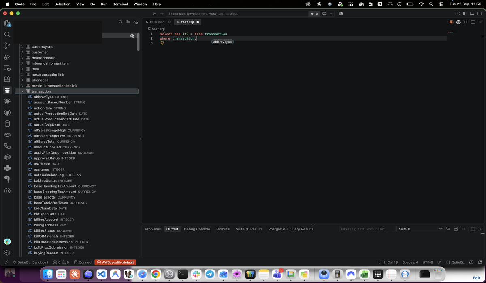
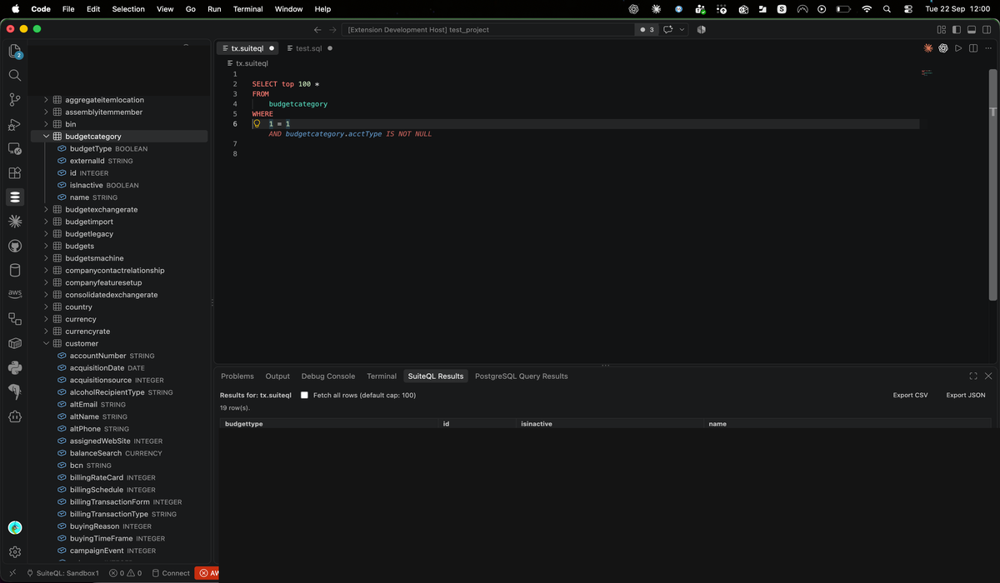
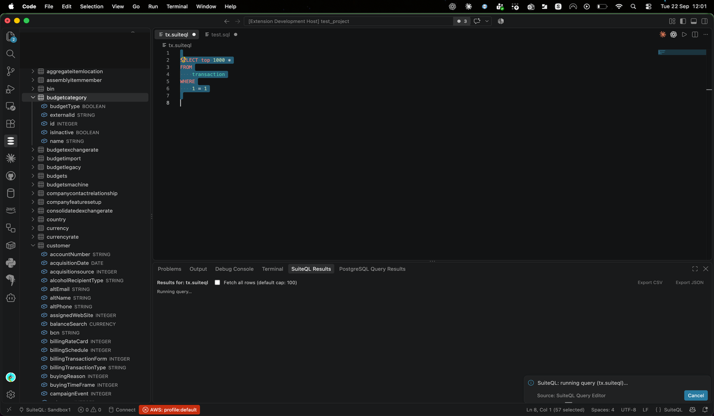
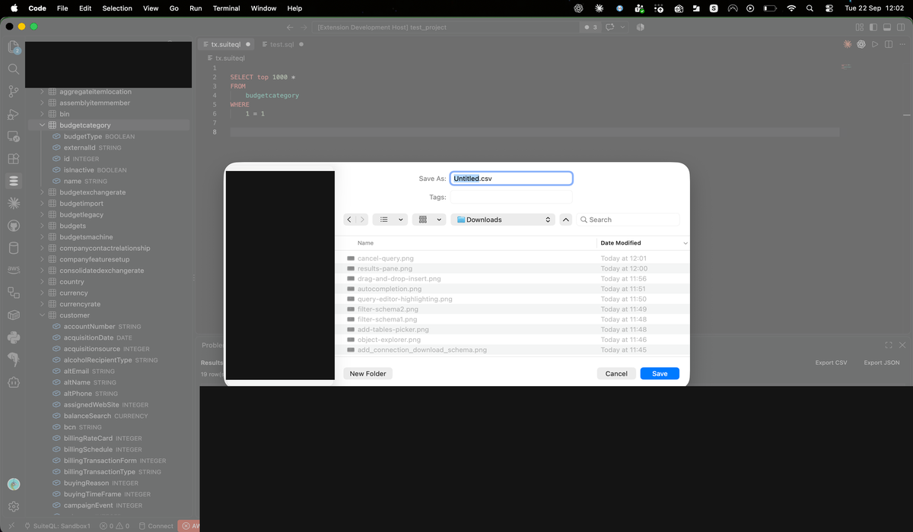

# SuiteQL Query Editor

Connect to NetSuite accounts and run SuiteQL queries, browse the record schema, and get
schema-aware autocompletion and syntax highlighting, directly from VS Code.

## Features

### Multiple connections

Save multiple labeled connections (e.g. "Production", "Sandbox1"), authenticated via
OAuth 1.0a Token-Based Authentication (TBA). Only one connection is active at a time —
switching connections disconnects the previous one. The active connection is shown in
the status bar; click it to switch or add another.

### Schema browser

A left-panel tree under the SuiteQL activity bar icon, showing every saved connection
(connected or not), the active connection's downloaded tables, and each table's columns
— sourced live from a per-connection RESTlet (see [Requirements](#requirements) below).

Schema is downloaded explicitly, never lazily on tree expand: run **"SuiteQL: Add
Tables to Schema"** to open a checkbox picker (pre-selecting commonly-queried tables),
select what you want, and it downloads just those tables' columns. Re-running the
picker later lets you add more tables without disturbing what's already downloaded.

Use **"SuiteQL: Filter Schema"** to narrow the tree to tables/columns matching a search
term — a table matching by its own name shows all its columns; one matching only
because a column inside it matches shows just that column.

### Query editor with schema-aware highlighting

Open a new SuiteQL query with **"SuiteQL: New Query"**, then run it with **"SuiteQL:
Run Query"** (or `Cmd+Shift+E` / `Ctrl+Shift+E`) against the active connection.
`.suiteql` files get full SQL syntax highlighting, plus semantic highlighting on top:
identifiers that match a table or column in your *actual downloaded schema* are colored
distinctly (tables vs. columns) — something a generic SQL grammar can't do, since it has
no way to know which identifiers are real NetSuite schema names versus arbitrary syntax.

### Autocompletion

Completion for SQL keywords, table names (after `FROM`/`JOIN`), and column names (after
`alias.`), sourced entirely from the downloaded schema.

### Drag tables/columns into a query

Drag a table or column from the object explorer and drop it into a SuiteQL editor to
insert its name at the drop position.

### Results pane

A docked panel showing query results as they come in. Every run defaults to a 100-row
cap; check "Fetch all rows" to paginate through the full result set instead.

A running query (including a "Fetch all" pagination loop) can be cancelled mid-flight
from its progress notification — the request in flight is aborted immediately rather
than being left to run out its retry budget.

### Export results

Export the current results to CSV or JSON. JSON export coerces columns back to their
real types (numbers, booleans) using the downloaded schema, instead of leaving every
value as a quoted string the way NetSuite's REST endpoint returns them.

## Requirements

A NetSuite account with a configured integration record and access token (TBA) — you'll
need the account ID/realm, consumer key/secret, and token ID/secret to add a connection.
This alone is enough to run queries and use the query editor.

**Schema discovery** (the object explorer tree, autocompletion, semantic highlighting)
additionally requires a per-connection RESTlet URL, set via **"SuiteQL: Set RESTlet
URL…"**. Without one, schema discovery is disabled (the object explorer shows a
"RESTlet not configured" prompt) but the editor and query execution still work — you can
still type and run queries by hand. The RESTlet itself is a companion server-side
project (`netsuite-schema-publisher`) deployed into the NetSuite account; see that
project's own README for setup.

## Commands

| Command | What it does |
|---|---|
| SuiteQL: Add Connection | Opens the Add Connection form |
| SuiteQL: Select Connection | Switch the active connection, or add a new one |
| SuiteQL: Remove Connection | Delete a saved connection and its stored secrets |
| SuiteQL: Set RESTlet URL… | Set/clear the RESTlet URL backing schema discovery for a connection |
| SuiteQL: Add Tables to Schema | Open the table picker and download selected tables' columns |
| SuiteQL: Clear Schema Cache | Discard a connection's downloaded schema |
| SuiteQL: Filter Schema / Clear Schema Filter | Search/reset the object explorer tree |
| SuiteQL: New Query | Open a new `.suiteql` file |
| SuiteQL: Run Query | Run the current file (or selection) against the active connection |

## Extension Settings

- `suiteql.connections`: saved connection profiles (label, realm, consumer key, token
  ID, RESTlet URL). Secrets (consumer secret, token secret) are never stored here — they
  live in VS Code's secret storage.

## Known Issues

- The completion provider, semantic highlighting, and results-column detection all use
  simple heuristics rather than a full SQL parser — they can be wrong on complex/nested
  queries.
- The results grid renders all fetched rows without virtualization; very large "Fetch
  all" results may be slow to render.
- Dragging a table/column into the editor requires the (default-on)
  `editor.dropIntoEditor.enabled` setting.

## Release Notes

### 0.0.1

Connection management, a RESTlet-backed schema browser, a query editor with schema-aware
syntax/semantic highlighting and autocompletion, drag-and-drop identifier insertion, a
results pane with cancellable/paginated execution, and CSV/typed-JSON export.
